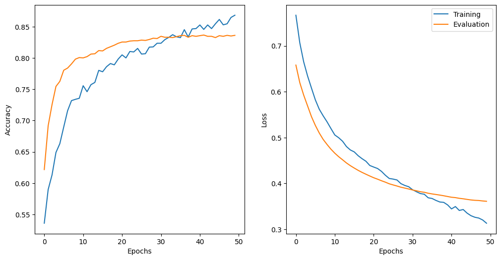

Hey there! Ever wondered how computers understand sentences? 🤖 Well, in this paper, we break down the magic of Convolutional Neural Networks (CNNs) for sentence classification. No rocket science, just a friendly chat about how these clever algorithms make sense of language. Dive in to explore the secrets of CNNs and make sense of the NLP world! 🧠✨

Read the full paper [here](https://arxiv.org/pdf/1408.5882.pdf).

# Introduction
Start by explaining what TextCNN is and why it's useful for understanding text. Share why you're looking into it and what you hope to find.

# How TextCNN Works
Break down how TextCNN does its job. Talk about its main parts like the layers that process text and how it figures out what the text is saying.

# The Results
Tell us what happened when you tried out TextCNN. Share the numbers and scores you got, and maybe use some charts or graphs to make it easy to understand.

# Pros and Cons
Talk about the good and not-so-good sides of TextCNN. When does it shine, and where might it struggle a bit? Be honest about what you found.

# Discussion
Think big picture. What do your results mean? How does TextCNN compare to other ways of understanding text? Explore where this could be helpful in real-life situations.

# Experiments
Disclaimer: This part is an extent. Explain how you set things up for your tests. What data did you use, how did you get it ready, and what choices did you make? This helps others understand and try it themselves.

# References

1. Author Name, "Title of Paper 1," *Journal Name*, Year.
   [Link to Paper 1]

2. Author Name, "Title of Paper 2," *Journal Name*, Year.
   [Link to Paper 2]

3. Author Name, "Title of Paper 3," *Journal Name*, Year.
   [Link to Paper 3]